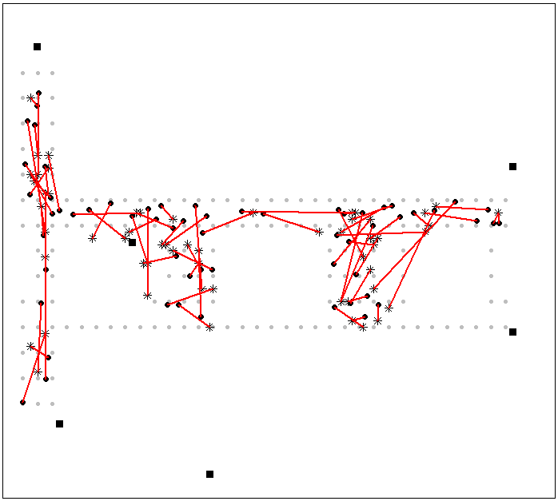

```{r setup, include=FALSE}
knitr::opts_chunk$set(echo = TRUE)
```

### Table of Contents: {#TOC}
<li>[Assignment Requirements](#AssignmentOutline)</li>
<li>[Introduction](#Introduction)</li>
<li>[**Part 1**](#Part1)</li> 
<ul> 
  <li>[Signal Collection](#SigCol)</li>
  <li>[Signal Strength](#SigStren)</li>
  <li>[Signal Density](#SigDen)</li>
  <li>[Discussion](#Discussion)</li>
  <li>[k-Nearest Neighbors](#knn)</li>
</ul>
<li>[**Part 2**](#Part 2)</li>

<li>[References](#References)</li>
<li>[Appendix](#Appendix)</li>


<a id='AssignmentOutline'>

### <b>Assignment</b> </a>
1. Conduct a more thorough data analysis into these two MAC addresses, including determining locations by using data corresponding to both the *chosen* and *rejected* Access Points:
    + *Which of these two MAC addresses should be used and which should not be used for Real Time Location System (RTLS)?*
    + *Which MAC address yields the best prediction of location? (Including determining locations by using data corresponding to both MAC addresses)?*
    + *Does using data for both MAC addresses simultaneously yield more, or less accurate prediction of location?*

2. Implement alternative k-nearest prediction method using weights on received signal strength.
    + *For what range of values of weights are you able to obtain better prediction values than for the unweighted approach?*
    + *Use calcError() to compare approaches.*

[&uarr;TOC](#TOC)

***  

<a id='Introduction'>

### <b>Introduction</b></a>  
#### *Explain the case study*

<font color = "purple"><b>>>>>Everything in this color to be removed at final review<<<<</b></font>

<font color = "purple"><b>
- Discuss the goal of the case study
</b></font>

The case study in chapter 1 of the book Data Science in R by Nolan and Lang presented an indoor posiitoning system (IPS) for WiFi devices on a floor of a building at the University of Mannheim. The IPS was trained and tested with data collected at the University with a hand-held device on a grid of 166 points spaced one meter apart in the hallways. The algorithm for the IPS is the K-Nearest Neighbors (k-NN). 

The original investigators used a hand-held scanning device at each point and recorded a timestamp, mac id of the device, position of the device, the orientation of the device, and the following data for each WiFi access point (AP): recevied signal strength, channel frequency, and device mode of operation. The WiFi APs were located throughout the building and identified by their unique Media Access Control (MAC) address.

<font color = "red"><b>
- Need example training input line
- Need table of training data: name, description, type, example
</b></font>

<font color = "purple"><b>
- Discuss the different Access points and MAC Addresses
</b></font>

Six APs were initially discovered in the original anlysis in the case study. The authors then decided to reject AP "00:0f:a3:39:dd:cd" (rejectedAP) stating it was identified as an extra address. The details of their reasoning was not clearly explained. The authors chose AP "00:0f:a3:39:e1:c0" (chosenAP) instead. This case study will evalute the author's decision and decide if the IPS system would be more accurate with the chosenAP, rejectedAP, or both APs.

<font color = "purple"><b>
- BRIEF overview of K-Nearest Neighbors
</b></font>

k-NN algorithm is an ideal method because we have an abundant training data and our prediction is not based on parametric relationship with the data. It is based on proximity. The downside is the model must hold the entire training data set for maximum predictability. The k-NN model is trained on the training data and then tested on the test data to determine its accuracy. The number of neighbors to used for location prediction is adjusted to reduce the accuracy.

<font color = "red"><b>
- can we still a graphic from scikit-learn of k-NN model?
</b></font>

In part 1 of the case study, the author's original decision to rejected an AP is revisited to see if this was the best decision. In part 2, the prediction of X,Y based on the average of its neighbors is revisited and modified to a weighted sum of X,Y to determine if this change will produce better predictions. Alternate weights will also be analyzed.

***
<a id='Part1'>

### Part 1</a>  
#### The Approach (Explained)

Before we begin, we will need to set the parameters for printing and formatting
```{r}
options(digits = 2)
options(error = recover, warn = 2)
```

Before continuing, we will need to address another file which houses the predefined functions. This helps to save notebook real estate and prevents confusion:
```{r}
source("MSDS7333-baldree-case6-fx.r", print.eval = TRUE)
```

Read offline data
```{r}
offline = readData()
```

Conduct a more thorough data analysis into these two MAC addresses, including determining locations by using data corresponding to both:
    
    * chosenAP = "00:0f:a3:39:e1:c0"
    * rejectedAP = "00:0f:a3:39:dd:cd"
    
Since we have the two MAC addresses in question, we will declare these addresses as variables to simplify later code. 

```{r}
chosenAP = "00:0f:a3:39:e1:c0"
rejectedAP = "00:0f:a3:39:dd:cd"
remainingAP = unique(offline[!offline$mac %in% c(chosenAP, rejectedAP),]$mac)
```


#### * *Which of these two MAC addresses should be used and which should not be used for Real Time Location System (RTLS)?*

To fully answer this question, we will need to explore exactly what is happening with each MAC address. The results of this exploration will define the parameters needed for such a decision.
<a id='SigCol'>

#### Here we will create a Signal Collection Map</a>
For this exercise, we will plot both the count and locations of the signals recorded for the access points. Even though it would be ideal to plot the access points(APs) directly on the map, we do not know their X and Y coordinates.

```{r}
plotSignalMaps(c(chosenAP, rejectedAP))
```

At first glance, we can see that the maps are quite similar. Unfortunately, the information gained from a visual comparison of these two diagrams does not give us a significant insight into which MAC address should be kept and which should be rejected. The next step to reach our goal will be to look at the individual Signal Strength Distributions

***
<a id='SigStren'>

#### Signal Strength Distributions</a>
Plotting the individual signal strength distributions for each AP angle will help add perspective to the information we are working with. For the sake of consistency, we will use the same stationary coordinates listed in the course book (coord : (2, 12)) <font color = "red">(Add reference here.)</font>

```{r}
df = subset(offline, posX ==2 & posY == 12 & !(mac %in% remainingAP), c(signal, angle, mac))
plotBoxplotSignalStrength(df)
```

From the literature, we know the higher the decibel-milliwatts means a stronger signal strength. A stronger signal strength indicates a closer physical position to the AP since signal strengths decrease exponentially with distance.<font color="red">Find this in the book and cite it.</font> Comparing the signal strength distributions in this chart, we see "e1:c0" has a stronger signal strength at this location than "dd:cd."

What if we compared the two addresses from the opposite side of the building? 
```{r}
# Let's focus on the fixed point (33,3)
df = subset(offline, posX == 33 & posY == 3 & !(mac %in% remainingAP), c(signal, angle, mac))
plotBoxplotSignalStrength(df)
```
Through the use of another perspective, the MAC address with the weaker signal at (2,12) still has a relatively weak signal when viewed from an AP at the other side of the building. The evidence against the address with the lower signal strength is mounting.

***
<a id='SigDen'>

#### Time to investigate Signal Density</a>
To properly investigate the difference between these two addresses, the signal strength densities for each address should be plotted for each 45 degree angle. This will help display the defining characteristics for each address. The location used for this analysis is the (24,4) from the book. 


```{r, fig.height=10}
df = subset(offline, posX == 24 & posY == 4 & !(mac %in% remainingAP), c(signal, angle, mac))
plotDensitySignalStrength(df)
```
From this plot, it can be seen that the rejectedAP has a higher signal density at lower strength while the acceptedAP has a higher density coverage at a higher strength. Judging by the distributions themselves, it seems as if many of the plots are normally distributed while some of the other plots (i.e. "dd:cd" at 180 and "e1:c0" at 315) are heavily skewed or even bimodal. Looking at each AP from top to bottom, there seems to exist an obvious pattern with respect to angle. This would suggest the median of each distribution varies by angle and attributes to a difference in perceived strength. 

*** 

#### Average Signal Strength Distributions
To examine the distribution for all locations and angles of the two APs in question, we will generate the summary statistics. The summary statistics for all possible combinations of locations and orientations for each AP through the use of a new factor. 

```{r}
offlineSummary = createOfflineSummary(offline)
```


```{r}
offline$posXY = paste(offline$posX, offline$posY, sep="-")

# create data frames for each combination
byLocAngleAP = with(offline, by(offline, list(posXY, angle, mac), function(x) x))
```

Now, we calculate the summary statistics:
```{r}
signalSummary = lapply(byLocAngleAP, function(oneLoc) {
  ans = oneLoc[1, ]
  ans$medSignal = median(oneLoc$signal)
  ans$avgSignal = mean(oneLoc$signal)
  ans$num = length(oneLoc$signal)
  ans$sdSignal = sd(oneLoc$signal)
  ans$iqrSignal = IQR(oneLoc$signal)
  ans
})
offlineSummary = do.call("rbind", signalSummary)
```

The Standard Deviation of the average signal strength per targeted AP:

```{r}
df = subset(offlineSummary, mac %in% c(chosenAP, rejectedAP), c(sdSignal, avgSignal, mac))
plotStdDevSignalStrength(df)
```

From this figure, it is apparent that there is considerable overlap between the two distributions of signal strength. This is evidence in favor of keeping both addresses in the analysis to provide greater coverage. 

***
<a id='Discussion'>

### Discussion</a>
#### We now have enough information to address these questions before an analysis of kNN is conducted: 

* **Which MAC address yields the best prediction of location? (Include determining locations by using data corresponding to both MAC addresses)**
* **Does using data for both MAC addresses simultaneously yield a more or less accurate prediction of location?**

The evidence thus far would suggest both addresses should be kept within the analysis to increase the coverage for the entire spectrum of strengths. The address chosen to be rejected not only has a lower signal strength when measured from either end of the building, but it also shows to have a higher signal density when it is further away from the receiver. The address chosen to be kept has a higher signal density closer to the receivers with the accompanying higher signal strengths. By keeping both addresses, the model should be able to generate a more accurate prediction of the layout of the building. This theory will be tested as we tour k-Nearest Neighbors. 

***

<a id='knn'>

#### Let's dive into the K-Nearest Neighbors:</a>

<font color = "red"><b>Discuss KNN here</b></font>

First and foremost, let's display the unique MAC addresses: 
```{r}
macs = unique(offlineSummary$mac)
macs
```

With the unique MAC addresses in hand, an accurate profile of the different signal strengths reveived by angle is able to be determined. This can be done with the following code: 
```{r}
online = readData("online.final.trace.txt", subMacs = macs)
online$posXY = paste(online$posX, online$posY, sep = "-")
length(unique(online$posXY))
tabonlineXYA = table(online$posXY, online$angle)
#output shows measurements were taken at all angles throughout the floor
tabonlineXYA
```
This output shows the signal strengths at each angle. This will be useful later!
<font color = "red"><b>&larr;Explain why &larr;</b></font>

Organize the data where each AP is in a column. 
```{r}
onlineSummary = castOnline(online)
#confirm rejected AP is included
dim(onlineSummary)
names(onlineSummary)
```

<font color = "purple">
(this can probably be removed)  

> for k-NN, we will include training data with angles close to point in question since angle matters.
> if we want one angle, then include angles that match the rounded orientation of new observation.
> if we want two angles, then pick two multiples of 45 degrees that flank the new observation's orientation.
> if we want three angles, then pick the closest 45 degree increment and on either side of it.
> what if we didn't want to collapse the signal strengths across the m angles, and
> instead return a set of mx166 signals for each access point?
</font>

When it comes to the kNN, we will need to include the data which include the angles close to the point in question. As observed before, the angle matters! For this exercise, we will need to abide by the following outlines: 
  
  * If one angle is desired, then we will include angles which match the rounded orientation of the new observation  
  * If we want two angles, two multiples of 45 degrees will be chosen in order to encapsulate the nw observation's orientation  
  * For three angles, the nearest 45 degree increment is chosen and either side will be used.   
  
What if we didn't want to collapse the signal strengths across the *m* angles and, instead, we return a set of mx166 signals for each access point? 

Here, we begin by iterating through 1-3 neighbors at 1-3 angles for each combination to determine which will be best suited for cross-validation: 

```{r}
for (ap in c("None", rejectedAP, chosenAP)){
  if (ap == "None"){
    test = onlineSummary
    train = offlineSummary
    newSignals = test[ , 6:12]
  } else {
    test = onlineSummary[, !(names(onlineSummary) %in% ap)]
    train = subset(offlineSummary, mac != ap)
    newSignals = test[,6:11]
  }
  
  estXY = predXY(newSignals = newSignals,
                 newAngles = test[, 4],
                 train, 
                 numAngles = 3, k = 3)
  actXY = test[ , c("posX", "posY")]
  err = calcError(estXY, actXY)
  
  print(paste(ap, err))
}
```

<font color="red"><b>&uarr;We will need to discuss these results&uarr;</b></font>


<font color = "green" size = "5px"><b>This is where we will perform cross validation and plot for desired AP for a range of k's </b></font>

Perform cross validation and plot for desired AP for a range of k's for each fold. We want to find k-NN estimates from 1 to k and aggregate errors over the v folds. 

Choose a v-fold of 11
```{r}
v = 11
```

### **Here be Dragons &darr;**

```{r}
# number of locations
permuteLocs = sample(unique(offlineSummary$posXY))

```

```{r}
# matrix locations into folds
permuteLocs = matrix(permuteLocs, ncol = v, nrow = floor(length(permuteLocs)/v))
```
<font color = "Red"><b>&uarr; come back to this one &uarr; For some reason it only runs after it throws an error (e.g.change matrix to sapply, run, change back and run again</b></font>

```{r}
# summarize and format offline
keepVars = c("posXY", "posX", "posY", "orientation", "angle")
onlineCVSummary = reshapeSS(offline, keepVars = keepVars, sampleAngle = TRUE)
```


```{r}
# number of k's
K = 10
# errors array
err = rep(0, K)

# loop through folds
for (j in 1:v) {
  testFold = subset(onlineCVSummary, posXY %in% permuteLocs[ , j])
  trainFold = subset(offlineSummary, posXY %in% permuteLocs[ , -j])
  actFold = testFold[ , c("posX", "posY")]

  # loop through neighbors
  for (k in 1:K) {
    estFold = predXY(newSignals = testFold[ , 6:12],
                     newAngles = testFold[ , 4],
                     trainFold, numAngles = 3, k = k)
    err[k] = err[k] + calcError(estFold, actFold)
  }
}
# plot k to sum of squared errors
plotSSErrors(err, K)
```


```{r}
# experiment with a few k's based on above analysis to determine k
# that results in lowest sum squared error on test data.
estXY = predXY(newSignals = onlineSummary[ , 6:12],
               newAngles = onlineSummary[ , 4],
               offlineSummary, numAngles = 3, k = 5)
actXY = onlineSummary[ , c("posX", "posY")]
calcError(estXY, actXY)
```

*** 
<a id='Part2'>

#Part 2: Alternative k-Nearest Neighbors
</a>

##2.1: Examination of Power-based search
The case study document mentioned the curvature in the scatterplots of signal strength versus distance, and suggested using a log function to attempt to remove the curve. Since the signal strength data are reported in dBm, they are already the result of a log function: $dBm = 10*log_{10}(power/1 mW)$; therefore, we converted the reported signal strength values back to a power value and examined the effect that had on location prediction.
Many of the functions used had to be modified to include the power conversion: $power = 10^{(signal/10)}$ and to use the new field in the calculations.
Examination of surface plots of power show that the power value tends to isolate the AP more definitively than signal strength because $power \propto 1/distance^2$.


The thought was that by having such a dramatic drop in power over a shorter range, we should be able to reduce the variability in predicted location and get better results.  However, when we simply substituted power for signal strength in the existing functions, the predictions using power were worse than using signal strength.


Using different values for 'k', we had these estimated errors:

| k |Mean distance error|Book-reported error|
|:-:|:-----------------:|:-----------------:|
| 1 |779.8603|659|
| 3 |598.8870|307|
| 4 |546.8603||
| 5 |640.8003|276|

Even though the power-based method better isolated the individual APs, we believe that the search algorithm should be redesigned to use all APs, instead of just one or two, due to the power drop-off.  As the distance from the reference AP increases, the power drops off so much that it becomes difficult to narrow down the actual location.  By redesigning the algorithm to use all APs, we may be able to capitalize on the power drop-off to better hone in on the target's location.


##2.2: Weighted K-Nearest Neighbors

```{r}
# create weights for neighbors based on signal strength and multiple times X and Y and sum neighbors
# to get X and Y.
estXY = predXY(newSignals = onlineSummary[ , 6:12],
               newAngles = onlineSummary[ , 4],
               offlineSummary, numAngles = 3, k = 5, weighted=TRUE)
actXY = onlineSummary[ , c("posX", "posY")]
calcError(estXY, actXY)
```

***
<a id='References'>

### References  
</a>

<a id='Appendix'>

### Appendix (including function code)  
</a>
This is the code used to define the functions used within the study. It can be found under 'MSDS7333-baldree-case6-fx.r' which is included in the final submission  
```{r}
processLine = function(x)
{
  # Process a line of text returning a 11x10 matrix of tokens
  #
  # Args:
  #   x: The line of text
  #
  tokens = strsplit(x, "[;=,]")[[1]]

  # return NULL if only 10 tokens
  if (length(tokens) == 10)
    return(NULL)

  tmp = matrix(tokens[-(1:10)], ncol = 4, byrow = TRUE)
  mat = cbind(matrix(tokens[c(2, 4, 6:8, 10)], nrow(tmp), 6, byrow = TRUE), tmp)
}

roundOrientation = function(angles) {
  # Round an array of degree angles to the nearest 45 degree angle.
  #
  # Args:
  #   angles: The line of text
  #
  refs = seq(0, by = 45, length  = 9)
  q = sapply(angles, function(o) which.min(abs(o - refs)))
  c(refs[1:8], 0)[q]
}


readData = function(filename = 'offline.final.trace.txt',
                    subMacs = c("00:0f:a3:39:e1:c0", "00:0f:a3:39:dd:cd", "00:14:bf:b1:97:8a",
                                "00:14:bf:3b:c7:c6", "00:14:bf:b1:97:90", "00:14:bf:b1:97:8d",
                                "00:14:bf:b1:97:81")) {
  # Process the csv file peforming the following steps:
  #   Read all non-comment lines.
  #   Call processLine() for each line of text.
  #   Convert list of text into a data frame
  #   Name columns of data frame
  #   Define column types
  #   Convert millisecond time to seconds
  #   Round angle orientations
  #   Drop data
  #
  # Args:
  #   filename: The name of the csv file to process. The default is 'offline.final.trace.txt.'
  #   subMacs: The list of access point MAC addresses to filter the dataset down to. A default list is provided.
  #
  # Returns:
  #   The data frame
  #

  # process csv into matrix of tokens
  txt = readLines(filename)
  lines = txt[substr(txt, 1, 1) != "#"]
  tmp = lapply(lines, processLine)
  # convert into tokens into a data frame
  df = as.data.frame(do.call("rbind", tmp), stringsAsFactors = FALSE)

  # variable names
  names(df) = c("time", "scanMac", "posX", "posY", "posZ", "orientation", "mac", "signal", "channel", "type")

  # convert numeric values
  numVars = c("time", "posX", "posY", "orientation", "signal")
  df[numVars] = lapply(df[numVars], as.numeric)

  # convert time to POSIX
  df$rawTime = df$time
  df$time = df$time / 1000
  class(df$time) = c("POSIXt", "POSIXct")

  # round orientations to nearest 45
  df$angle = roundOrientation(df$orientation)

  # keep only signals from access points
  df = df[df$type == "3",]
  df = df[, "type" != names(df)]

  # drop scanMac, posZ, channel, and type - no info in them
  df = df[, !(names(df) %in% c("scanMac", "posZ"))]

  # drop more unwanted access points
  df = df[df$mac %in% subMacs,]

  # drop channel
  df = df[, "channel" != names(df)]

  return(df)
}

plotBoxplotSignalStrength = function(df) {
  # Box plot signal strength
  #
  # Args:
  #   df: data frame of data to analyze
  #
  oldPar = par(mar = c(3.1, 3.1, 1, 1), mfrow = c(1,1))
  par(mai=c(.8, .8, .5, .25))
  library (lattice)

  print(bwplot(signal ~ factor(angle) | mac, data = df, layout = c(2,1),
               main="Signal Strength Distribution for Access Points",
               xlab="Angle Measured (deg)", ylab="Signal Strengh (dBM)"))
  par(oldPar)
}

plotDensitySignalStrength = function(df) {
  # Density plot signal strength
  #
  # Args:
  #   df: data frame of data to analyze
  #
  oldPar = par(mar = c(3.1, 3.1, 1, 1), mfrow = c(1,1))
  par(mai=c(.8, .8, .5, .25))
  library (lattice)

  print(densityplot( ~ signal | mac + factor(angle), data = df, bw = 0.5, plot.points = FALSE,
        main="Signal Strength Distribution for Access Points",
        xlab="Angle Measured (deg)", ylab="Signal Strengh (dBM)"))
  par(oldPar)
}

plotStdDevSignalStrength = function(df) {
  # Standard Deviation of signal strength average
  #
  # Args:
  #   df: data frame of data to analyze
  #
  oldPar = par(mar = c(3.1, 3.1, 1, 1), mfrow = c(1,1))
  par(mai=c(.8, .8, .5, .25))
  library (lattice)
  breaks = seq(-90, -30, by=5)

  print(bwplot(sdSignal ~ cut(avgSignal, breaks=breaks) | mac, data=df,
               xlab = "Mean Signal (dBM)", ylab = "Signal Standard Deviation (dBM)",
               main = "Standard Deviation of Average Signal Strength from Detector to Access Point",
               cex.main=.8, cex.axis=.8, cex.lab=.8, layout = c(1, 2)))
  par(oldPar)
}


plotSignalMaps = function(macAddresses) {
  # Plot the number of signals per XY location at XY location.
  #
  # Args:
  #   macAddresses: a list of macs to plot signals
  #
  oldPar = par(mar = c(3.1, 3.1, 1, 1), mfrow = c(1,1))
  par(mfrow = c(2, 1), mai=c(.8, .8, .4, .25))

  for (i in macAddresses) {
    # filter data set
    df = offline[offline$mac %in% i, ]
    # location of datapoints filtered
    locDF = with(df, by(df, list(posX, posY), function(x) x))
    # drop locations that were not observed, null
    locDF = locDF[!sapply(locDF, is.null)]

    # determine the number of observations recorded at each location
    locCounts = sapply(locDF, nrow)

    # keep position information with location
    locCounts = sapply(locDF, function(df) c(df[1, c("posX", "posY")], count = nrow(df)))

    # transpose matrix
    locCounts = t(locCounts)
    plot(locCounts, type = "n", xlab = "Position X", ylab = "Position Y",
         main = paste("Total Signals from Detector to Access Point: ", i),
         cex.main=.8, cex.axis=.8, cex.lab=.8)
    text(locCounts, labels = locCounts[, 3], cex = .6, srt = 45)
  }
  par(oldPar)
}

castOnline = function(df) {
  # Cast dataframe of online data so each access point (AP) is in its own column.
  # Matrix is now a 1x7 since we are including rejected AP.
  #
  # Args:
  #   df: online data frame
  #
  keepVars = c("posXY", "posX","posY", "orientation", "angle")
  numOfAPs = length(unique(df$mac))
  byLoc = with(df,
               by(df, list(posXY),
                  function(x) {
                    ans = x[1, keepVars]
                    avgSS = tapply(x$signal, x$mac, mean)
                    y = matrix(avgSS, nrow = 1, ncol = numOfAPs,
                               dimnames = list(ans$posXY, names(avgSS)))
                    cbind(ans, y)
                  }))
  return(do.call("rbind", byLoc))
}

createOfflineSummary = function(df) {
  # In order to examine distribution for all locations, angles, and are two interested APs, we
  # will create a summary statistics for all location-orientation-AP combinations with a new factor.
  # For each combination there are around 100 observations.
  #
  # Args:
  #   df: offline data frame
  #
  df$posXY = paste(df$posX, df$posY, sep="-")

  # create data frames for each combination
  byLocAngleAP = with(df, by(df, list(posXY, angle, mac), function (x) x))

  # summary statistic
  signalSummary = lapply(byLocAngleAP, function(oneLoc) {
    ans = oneLoc[1, ]
    ans$medSignal = median(oneLoc$signal)
    ans$avgSignal = mean(oneLoc$signal)
    ans$num = length(oneLoc$signal)
    ans$sdSignal = sd(oneLoc$signal)
    ans$iqrSignal = IQR(oneLoc$signal)
    ans
  })
  return(do.call("rbind", signalSummary))
}

reshapeSS = function(df,
                     varSignal = "signal",
                     keepVars = c("posXY", "posX", "posY"),
                     sampleAngle = FALSE,
                     refs = seq(0, 315, by=45)) {
  # reshape signal strength help function
  # aggregate signal strengths from these angles and create a data structure similar to onlineSummary
  # Args:
  #   df: dataframe to reshape
  #   varSignal: variable to aggregate
  #   keepVars: variables to retain
  #   sampleAngle: true if we want to select one angle at random from df
  #   refs: angle references
  #
  numOfAPs = length(unique(df$mac))
  byLocation = with(df, by(df, list(posXY),
                             function(x) {
                               # select one angle at random for each location
                               if (sampleAngle) {
                                 x = x[x$angle == sample(refs, size = 1), ]}
                               ans = x[1, keepVars]
                               avgSS = tapply(x[, varSignal], x$mac, mean)
                               y = matrix(avgSS, nrow = 1, ncol = numOfAPs,
                                          dimnames = list(ans$posXY, names(avgSS)))
                               cbind(ans, y)
                             }))
  return(do.call("rbind", byLocation))
}

selectTraininingData = function(newObservationAngle, df = NULL, m = 1){
  # select observations from df to analyze aggregate signal strengths
  # from these angles and create a data structure similar to onlineSummary.
  #
  # Args:
  #   newObservationAngle: the angle of the new observation
  #   df: offline summary data frame
  #   m: number, between 1 and 5, of angles to keep

  # m is the number of angles to keep between 1 and 5
  refs = seq(0, by = 45, length  = 8)
  nearestAngle = roundOrientation(newObservationAngle)

  # handle odd and even m number
  if (m %% 2 == 1)
    angles = seq(-45 * (m - 1) /2, 45 * (m - 1) /2, length = m)
  else {
    m = m + 1
    angles = seq(-45 * (m - 1) /2, 45 * (m - 1) /2, length = m)
    if (sign(newObservationAngle - nearestAngle) > -1)
      angles = angles[ -1 ]
    else
      angles = angles[ -m ]
  }
  # map angles to values in refs
  # negative angles and angles greater than 360 are mapped to appropriate angles; e.g., -45 maps to 335 and 405 maps to 45
  angles = angles + nearestAngle
  angles[angles < 0] = angles[ angles < 0 ] + 360
  angles[angles > 360] = angles[ angles > 360 ] - 360
  angles = sort(angles)
  # select observations to analyze
  subset = df[df$angle %in% angles, ]
  # reshape signal strength
  return(reshapeSS(subset, varSignal = "avgSignal"))
}

findNN = function(newSignal, trainingSubset) {
  # want to look the distance in terms of signal strengths from these training data to the new
  # data point. we need to calculate teh distrance from the new point to all observations in the
  # training set with findNN().
  # returns locations of the training observations in order of closeness to the new observation's signal strength.
  #
  # Args:
  #   newSignal: signal of new observation
  #   trainingSubset: training data to find neighbors
  # Returns:
  #   training neighbors
  #
  cols = length(trainingSubset)
  diffs = apply(trainingSubset[ , 4:cols], 1, function(x) x - newSignal)
  dists = apply(diffs, 2, function(x) sqrt(sum(x^2)) )
  #closest = order(dists)
  closest = cbind(trainingSubset[, 1:3 ], dists)
  return(closest[order(dists),])
  #return(trainingSubset[closest, 1:3 ])
}

predXY = function(newSignals, newAngles, training, numAngles = 1, k = 3, weighted=FALSE){
  # Predict the XY coordinates given a list of signals along with their angles measured and training data.
  # k neighbors will be found to make the prediction of coordinate.
  #
  # Args:
  #   newSignals: list of signals to predict
  #   newAngles: list of angles for signals to predict
  #   trainingData: data needed for k-nn
  #   numAngles: angles we want to use for prediction
  #   k: number of neighbors to use for prediction
  #   weighted: if TRUE, distances to neighbors will be used to weight XY for each neighbor to determine
  #             location.
  #
  closeXY = list(length = nrow(newSignals))

  for (i in 1:nrow(newSignals)) {
    trainSS = selectTraininingData(newAngles[i], training, m = numAngles)
    closeXY[[i]] = findNN(newSignal = as.numeric(newSignals[i, ]), trainSS)
  }
  # for some k of nearest neighbors, simply average the first k locations
  # could have used weights in the average that are inversely proportional to the distance in signal strength
  # from the test observation. will need to call findNN() to get distance to point. the weights
  # are 1/d / sum(1/d).
  # could also use a different metric besides Euclidean like Manhattan.
  # could use medians instead of averages when combining neighbors if the distribution of values are quite skewed.
  if (!weighted) {
    estXY = lapply(closeXY, function(x) sapply(x[ , 2:3], function(x) mean(x[1:k])))
  } else {
    # sum X and Y weighted neighbor values.
    estXY = lapply(closeXY, function(x) {
      wt = (1/x[1:k, 4])/sum(1/x[1:k, 4])
      xy = cbind(x[1:k,], wt)
      # sum weighted neighbors
      return(colSums(xy[1:4, 2:3] * xy[1:4, 4]))
    })
  }
  return(do.call("rbind", estXY))
}

calcError = function(estXY, actualXY) {
  # compare fit numerically with sum of squared errors
  #
  # Args:
  #   estXY:
  #   actualXY:
  # Returns:
  #   calculated residual sum of squares
  return(sum(rowSums((estXY - actualXY) ^ 2)))
}

plotSSErrors = function(err, K){
  # Plot results as sum of squared errors as function of k
  #
  # Args:
  #   err: Error array
  #   K: number of neighbors
  #

  oldPar = par(mar = c(3.1, 3.1, 1, 1), mfrow = c(1,1))
  par(mai=c(.8, .8, .4, .25))

  plot(y = err, x = (1:K),  type = "l", lwd= 2, ylim = c(900, 2100), cex.main=.8, cex.axis=.8, cex.lab=.8,
       xlab = "Number of Neighbors",
       ylab = "Sum of Squared Errors",
       main = "Cross Validation Section of k")

  rmseMin = min(err)
  kMin = which(err == rmseMin)[1]
  segments(x0 = 0, x1 = kMin, y0 = rmseMin, col = gray(0.4), lty = 2, lwd = 2)
  segments(x0 = kMin, x1 = kMin, y0 = 800,  y1 = rmseMin, col = grey(0.4), lty = 2, lwd = 2)
  text(x = kMin - 2, y = rmseMin + 40, label = as.character(round(rmseMin)), col = grey(0.4), cex = .6)

  par(oldPar)
}

wt_signals <- function(ByAvgSig){
  
  # Name: wt_signals
  # Create weighted data
  #
  # Args:
  #   ByAvgSig:    estimate XY line segment
  #   
  # Returns:
  #   log_ang by weighted_signals matrix
  
  # calculate signals
  signals <- select(ByAvgSig, -posXY, -posX, -posY, -angle) 
  
  # calculate log_ang
  loc_ang <- select(ByAvgSig, posXY, posX, posY, angle)
  
  # calculate weighted_signals 
  weighted_signals <- (1/signals) / rowSums(1/signals)
  
  return(cbind(loc_ang, weighted_signals))
}
```
