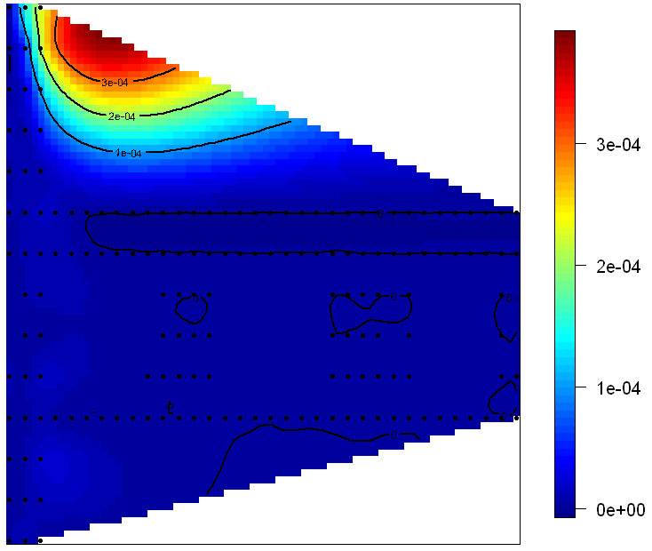
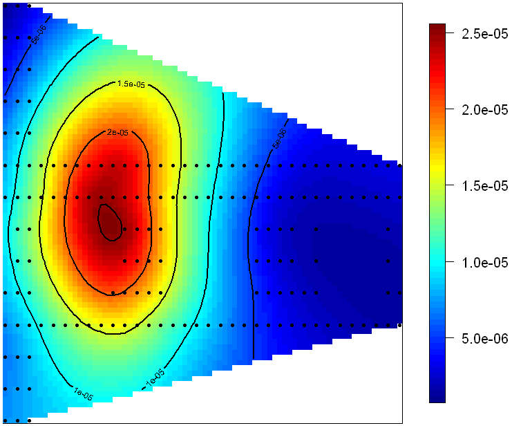

##2.1: Examination of Power-based search
The case study document mentioned the curvature in the scatterplots of signal strength versus distance, and suggested using a log function to attempt to remove the curve. Since the signal strength data are reported in dBm, they are already the result of a log function: $dBm = 10*log_{10}(power/1 mW)$; therefore, we converted the reported signal strength values back to a power value and examined the effect that had on location prediction.
Many of the functions used had to be modified to include the power conversion: $power = 10^{(signal/10)}$ and to use the new field in the calculations.
Examination of surface plots of power show that the power value tends to isolate the AP more definitively than signal strength because $power \propto 1/distance^2$.

The thought was that by having such a dramatic drop in power over a shorter range, we should be able to reduce the variability in predicted location and get better results.  However, when we simply substituted power for signal strength in the existing functions, the predictions using power were worse than using signal strength.

Using different values for 'k', we had these estimated errors:

| k |Mean distance error|Book-reported error|
|:-:|:-----------------:|:-----------------:|
| 1 |779.8603|659|
| 3 |598.8870|307|
| 4 |546.8603||
| 5 |640.8003|276|

Even though the power-based method better isolated the individual APs, we believe that the search algorithm should be redesigned to use all APs, instead of just one or two, due to the power drop-off.  As the distance from the reference AP increases, the power drops off so much that it becomes difficult to narrow down the actual location.  By redesigning the algorithm to use all APs, we may be able to capitalize on the power drop-off to better hone in on the target's location.

##2.2: Investigating Weights

The description of the weighting procedure brought up some questions about the meaningfulness of the approach.  This led to a side investigation of how the nearest-neighbors method might be affected by weights.

The investigation involved exporting the offine summary dataset and the online dataset to CSV files for use in Excel.  Then we looked at the process manually - taking the first report in the online dataset that matched our reference AP and looking for nearest neighbors in the offline summary dataset.  The target record stated the true position to be 0, 0.05 (lower left corner of the building).  The reference AP is within line of sight of the target device at coordinates 1,14.

First, we selected only those records in the offline summary that matched the AP, then further filtered to those records that matched orientation.  Plotting the measured signal strength for the AP and orientation, we can see that there is a fairly extensive swath of positions in which the target signal strength can occur.

.

Using the Excel function SMALL, we can find the n smallest differences - these would be the nearest neighbors.

|Record#|Sig Str Diff|Pos X|Pos Y|
|:-----:|:----------:|:---:|:---:|
| 3767  | 0.0196078  | 4   | 7   |
|  357  | 0.0202128  | 1   | 2   |
|  117  | 0.3846154  | 2   | 0   |
| 3817  | 0.9354839  | 3   | 7   |
|  505  | 1.0510204  | 1   | 3   |

Avg X = 2.2; Avg Y = 3.8; True X = 0.0; True Y = 0.05; Error = 4.3477

We can see that the target's reported signal strength occurs throughout the corridor as shown in the signal strength plot above.  Averaging those values pulls the estimate away from the true area.

If we consider weighting the neighbors based on physical distance (as was suggested in the case study), the points closer to the AP will be weighted higher than the points further away, which would (in this particular example) pull the estimated location further away from the true location and closer to the AP, which would increase the error.  This is what led to this investigation in the first place.

The case study also hints at using multiple APs to do the neighbor selection.  If, for example, we chose the AP at the opposite corner of the building (the lower right corner), and examined the same target report as before, we can see an additional problem: 

Now if we look for just simple differences in signal strength, we can get points for either AP that could be spread across the entire building.

|Record#|Sig Str Diff|Pos X|Pos Y|AP|
|:-----:|:----------:|:---:|:---:|:-:|
|  670  | 0.0625     | 4   | 3   |1, 14|
|  2568 | 0.0919540  | 15  | 8   |33.5, 2.8|
|  856  | 0.1034483  | 11  | 4   |33.5, 2.8|
|  936  | 0.1263158  | 12  | 5   |33.5, 2.8|
|  408  | 0.1612903  | 0   | 7   |1, 14|

Avg X = 8.4; Avg Y = 5.4; True X = 0.0; True Y = 0.05; Error = 9.959

Again, weighting the neighbors on physical distance reinforces a location closer to the AP at 33.5, 2.8, which increases the error from the true location.

One possible approach is to use the simultaneous measurements as a group and find nearest neighbors that exhibit similar patterns.  For example the test record we have used here is part of a series of measurements taken at the same time and orientation.  The highest average signal strength was against AP 97:8A (-43.25 dBm) and the lowest average signal strength was against AP 97:8D (-63 dBm). If we search for that pattern in the training data, we get a more reasonable set of neighbors:

|Timestamp|97:8A signal|97:8D signal|Signal "Dist"|Pos X|Pos Y|
|:-------:|:----------:|:----------:|:-----------:|:---:|:---:|
|02:45:43 | -43 | -63 | 0.25  |1 | 5 |
|02:14:34 | -44 | -63 | 0.75  |1 | 4 |
|01:06:28 | -44 | -61 | 2.136 |0 | 1 |
|06:31:15 | -41 | -63 | 2.25  |2 | 12|
|00:35:27 | -41 | -64 | 2.462 |0 | 0 |

Avg X = 0.8; Avg Y = 4.4; True X = 0.0; True Y = 0.05; Error = 4.423

